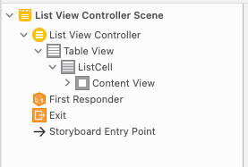
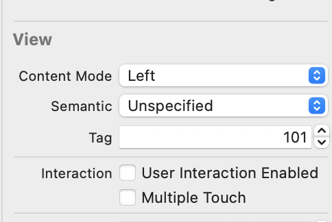
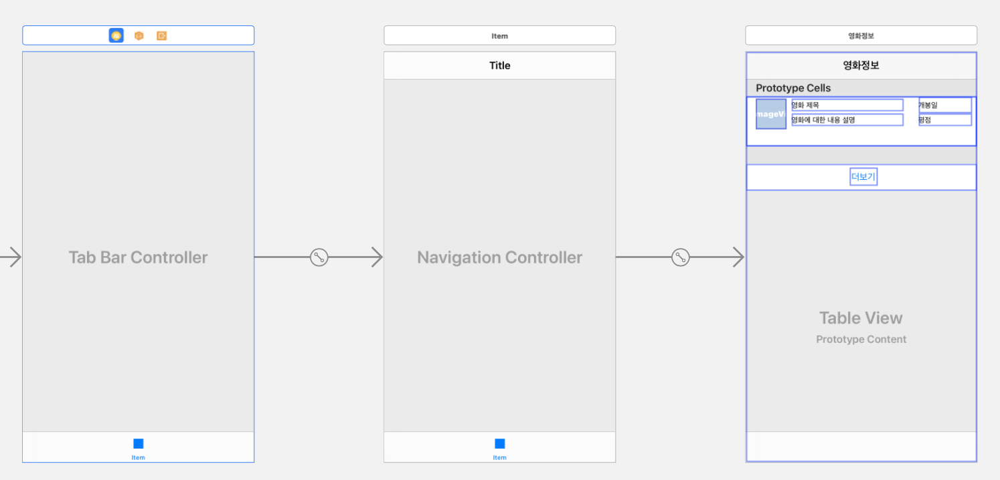

# LUVLUVMOVIE  IOS 개발버전

> 참고문헌 : 꼼꼼한 재은씨의 Swift 기본편, 실전편

## 1일차

### 테이블 뷰를 이용한 데이터 목록 구현

<details>
<summary>자세히</summary>
	<div markdown="1">
> 영화의 썸네일 그리고 제목, 일자를 포함한 목록을 보여주기 위해서 TableView를 이용하여 목록을 구현한다.




하나의 화면을 의미하는 씬은 보통 하나의 View Contriller로 구성되는데 위에서응 `List View Controller`가 씬을 담당한다. `Table View` 가 최상위 루트뷰, 여러개의 행을 여기서는 `ListCell` 이라고 하고 다시 내부 `content View`를 갖는다. 


1) 테이블 뷰를 구현하기 위해서는 `UIViewContoller` 대신에 `UITableViewController` 클래스를 상속받아야한다.

- 화면이 구성되는 요소마다 대응하는 클래스가 있지만 다 외울수 없고 Reference를 찾아가면서 해야한다. 자주 쓰는건 외우는게 좋아!

2) `ListCell`은 타입이 나눠져 있으며 프로토타입 셀 = `ListCell` 을 참조하기 위해서 식별 아이디를 부여하는게 좋다. 코드에서 프로토 타입 셀을 참조할 때 사용됨

3) `TableView`의 데이터 소스는 정적방법과 계속 데이터가 바뀌는 동적 방법이 있는데 대부분 동적이다. 


#### 1. 데이터 모델링

- MoiveVO.swift

  > 값이 없을 수 있으므로 옵셔널 변수로 저장한다.

```swift
import Foundation
import UIKit

class MovieVO {
    var thumbnail: String? //썸네일 이미지 주소
    var title : String? // 영화 제목
    var description: String? // 영화 정보
    var detail : String? // 영화 상새설명
    var opendate : String? // 영화 개봉일
    var rating : Double? // 영화 평점
    // 영화 썸네일 이미지를 담을 UIImage 객체를 추가한다.
    var thumbnailImage: UIImage?
}

```

- ListViewcontrolller.swift

```swift
import UIKit

class ListViewController: UITableViewController{
    // 튜플 아이템으로 구성된 데이터 세트
    
    var dataset = [
        ("다크 나이트", "영웅물에 철학에 음악까지 더해져 예술이 되다.", "2008-09-04", 8.95),
        ("호우시절", "떄를 알고 내리는 좋은 비", "2009-10-08", 7.31),
        ("말할 수 없는 비밀", "여기서 너 까지 다섯 걸음", "2014-05-07",9.19)
    ]
    
    lazy var list: [MovieVO] = {
        var datalist = [MovieVO]()

        for (title, desc, opendate, rating) in self.dataset {
            let mvo = MovieVO()
            mvo.title = title
            mvo.description = desc
            mvo.opendate = opendate
            mvo.rating = rating
            datalist.append(mvo)
        }
        return datalist
    }()
    
    override func viewDidLoad() {
        
    }
}
```

- 배열문법 

> 아래 문법 이이해가 안갓는데 [] 안에있는 MovieVO의 데이터를 요소로 갖는 빈 배열을 생성한다는 것이다. 지금 MovieVO는 클래스이기 때문에 저기 배열에는 MovieVO 클래스 즉 타입이 datalist 변수에 지정된다.

```swift
var datalist = [MoiveVO]()
```

- lazy var문법

**1) lazy closure 라는 문법인데 초기화할때 주로 사용된다.** 지연저장 프로퍼티 코드 블럭이 정확히 해당 변수의 읽기 작업이 일어날떄만 실행되기 떄문이다.따라서 메모리 누수를 줄일 수 있다.

2) 반드시 var와 사용되야하는데 기본적으로 lazy로 선언되는 변수는 초기에 값을 존재하지 않고 이후에 값이 생성되기 떄문에 let으로 선언될 수 없다.

```swift
lazy var list: [MovieVO] = { // list 변수가 불러질떄 생성된다.
        var datalist = [MovieVO]()
        return datalist //datalist가 클로저 문법으로쓰여서 이 값이 list에 담겨 list는 결국 datalist 타입과 같은 변수가 된다.
    }()
```


#### 2. 데이터 뷰와 소스 연동

> 생각할점 : 데이터 소스를 연동할떄 즉 뭘 보여줄껀데? 1) 몇개의 행으로 구성되나 2) 각 행의 내용은 어떻게 구성되나? 를 생각한다. 

1) 프로토타입이 정해진 셀(CELL)

```swift
    override func tableView(_ tableView: UITableView, numberOfRowsInSection section: Int) -> Int { // 생성해야 할 행의 개수를 반환하는 메소드 상위 클래스인 UITableView에 지정되어있어 override해줘야한다.
        return self.list.count // 생성되는 list갯수만큼 리턴 해줘야한다.
    }
    
    override func tableView(_ tableView: UITableView, cellForRowAt indexPath: IndexPath) -> UITableViewCell { // 테이블 뷰 의 개별 행 내용을 담는 것
        let row = self.list[indexPath.row] // 행의 번호를 알고 싶을떄 list[indexPath.row]를 사용하면 알 수 있다.
        let cell = tableView.dequeueReusableCell(withIdentifier: "ListCell")! // cell 객체를 생성,
        cell.textLabel?.text = row.title // 만약 테이블 셀의 textLabel 속성에 값이 있으면 하위 속성인 .text에 row.title 값을 대입하고 , 없으면 아무것도 처리하지 않는다. 라는 의미 오류가 발생안해! 옵셔널 체인
        cell.detailTextLabel?.text = row.description
        return cell
    }
    
    override func tableView(_ tableView: UITableView, didSelectRowAt indexPath: IndexPath) { //테이블 셀을 클릭했을때 실행되는 함수
        NSLog("선택된 행은\(indexPath.row) 번째 행입니다.")
    }
```

- 네비게이션 콘트롤러를 삽입해서 아이템을 추가하고, 타이틀을 입력시킨다.

> [Editor] -> [Embed In] -> [Navigator Controller] 를 통해 해당 컨트롤러에 네비게이션 바를 삽입할 수 있다. 

- 내용이 없으면 빈목록이 줄처럼 표시되는게 불편해! -> 오브젝트 라이브러리에서 [View] 객체를 드래그해서 프로토타입 셀 아래 영역에 추가한다.


2) 프로토타입 커스텀 셀 하기

- 라벨 오브젝트를 만들고 태그 번호를 붙인다. 화면에 구성되는 요소들을 일일이 연결하는 방법이있지만 많아지면 헷갈린다. 아울렛 변수를 이용해서 프로토타입 셀에 대한 커스텀 클래스를 구현해야한다. 일단 작성 후에는 관리가 용의하다는 장점이 있음.

- 

- ListViewController.swift

```swift
  override func tableView(_ tableView: UITableView, cellForRowAt indexPath: IndexPath) -> UITableViewCell { // 테이블 뷰 의 개별 행 내용을 담는 것
        let row = self.list[indexPath.row] // 행의 번호를 알고 싶을떄 list[indexPath.row]를 사용하면 알 수 있다.
        let cell = tableView.dequeueReusableCell(withIdentifier: "ListCell")! // cell 객체를 생성,
    
        let title = cell.viewWithTag(101) as? UILabel
        
        let desc = cell.viewWithTag(102) as? UILabel
        
        let opendate = cell.viewWithTag(103) as? UILabel
        
        let rating = cell.viewWithTag(104) as? UILabel
        
        title?.text = row.title
        desc?.text = row.description
        opendate?.text = row.opendate
        rating?.text = "\(row.rating!)"
        
        return cell
    }
```


- **커스텀 클래스로 프로토타입 셀의 객체 제어하기**

> 이방법이 더 좋다. 처음에 초기 설정을 해야하니까 번거롭지만 다양한 객체의 커스텀 클래스를 이해할 수 있다. 가장 좋은건 잘못된 태그값을 호출 하는 문제에서 자유로워 질 수 있다. 

</div>
</details>


## 2일차

### TMDB 데이터 연동

<details>
<summary>자세히</summary>
	<div markdown="1">
> `viewDidLoad)()` 메소드 내부에서 REST 메소드를 호출해 줘야한다. 


- GET 방식으로 REST 메소드를 호출하여 데이터를 읽어오는 방법은 다음과 같다. 

```swift
var list = Data(contentsOf: URL타입의 객체)
```

- 서버에 응답을 받지 못하는 경우도 있기 때문에 항상 옵셔널 타입값을 갖는다. 

#### 1. https요청이 아닐경우

> **http로 요청을 보낼 경우 info.plist 파일을 선택하고 [Open AS] -> [Source Code] 에 아래 코드를 붙여 넣는다.**

```xml
    <key>NSAppTransportSecurity</key>
    <dict>
        <key>NSAllowsArbitraryLoads</key>
        <true/>
    </dict>
```


#### 2. JSON 객체를 파싱해서 NSDictionary 객체로 변환하기

> 네트 워크를 통해 호출한 API 데이터는 apidata 상수에 저장되어 있고 이는 Data 타입이어서 바로 꺼내 쓰기가 어렵다. 테이블을 구성하려는 데이터로 사용하려면 NSDictionary 객체로 변환을 해야한다. 

- 데이터 형식에 따라 `NSArray`, `NSDictionary`로 형태를 적절히 캐스팅해주면된다.

- 먼저 JSON 객체를 파싱하려면 JSONSerializtion 객체의 jsonObject() 메소드를 사용하는게 좋다. JsonObject() 메소드는 do ~ try ~ catch()구문으로 감싸 오류가 바생하면 catch 블록으로 실행 흐름이 전달된다.

```swift
do {
  let apiDictonary = try JSONSerialization.jsonObject(with: apidata, options: []) as! NSDictionary
} catch {
}
```

#### 3. 더보기 기능 구현

> 아주 작은 데이터가 아닌이상 전체 데이터를 한꺼번에 주고 받으면안 된다. 한꺼번에 읽어오면 처리 속도가 늦어지는 성능상의 문제를 일으킬 수 가 있다. 

- 추가한 데이터를 테이블 뷰가 읽어오도록 해야하는게 핵심 

```swift
  @IBAction func more(_ sender: Any) {
        self.page += 1
        // 영화 차트 API 호출
        self.callMovieAPI()
        // 데이터를 다시 읽어오도록 갱신해야한다.
        self.tableView.reloadData()  
    }
```

- callMovieAPI함수를 불러 올떄마다 list에 append 되기 떄문에 값이 계속 쌓이게 된다.

#### 4. 리팩토링

- 영화 차트 API를 호출하는 메소드를 만들어 중복 코드를 최소화했다.

```swift
 func callMovieAPI() {
        let url = "https://api.themoviedb.org/3/movie/popular?api_key=9c16b0e3f97fb175552f5d4ee8d06016&language=ko-KR&page=\(self.page)"
        
        let apiURL: URL! = URL(string: url)
        
        let apidata = try! Data(contentsOf: apiURL)
        
        let log = NSString(data:apidata, encoding: String.Encoding.utf8.rawValue) ?? "데이터가 없습니다."
        
        NSLog("\(log)")
        
        do {
            let apiDictionary = try JSONSerialization.jsonObject(with: apidata, options: []) as! NSDictionary
            
            let movie = apiDictionary["results"] as! NSArray
            
            for row in movie {
                // 순회 상수를 NSDictionary 타입으로 캐스팅
                let r = row as! NSDictionary
                
                let mvo = MovieVO()
                mvo.title = r["title"] as? String
                mvo.description = r["overview"] as? String
                mvo.thumbnail = r["poster_path"] as? String
                mvo.detail = r["original_title"] as? String
                mvo.rating = r["vote_average"] as? Double
                mvo.opendate = r["release_date"] as? String
                // 배열에 추가
                self.list.append(mvo)
            }
            
        } catch {
            NSLog("Parse Error!!!")
        }
    }
```

</div>
</details>

## 3일차 

### 테이블 뷰의 동작원리

<details>
<summary>자세히</summary>
	<div markdown="1">
> 드래그 할때마다 대기상태에 있던 데이터를 화며에 표시한다.


 #### 1. 재사용 메커니즘

- IOS의 부드러운 화면을 위해 사용되는 메커니즘 중 하나이다.
- 데이터 소스는 테이블 뷰의 재사용큐(Reuse Queue)에서 사용 가능한 셀이 있는지 확인하여 만일 있으면 그 중하 하나를 꺼내 전달하고, 없으면 새로운 셀을 생성한다. 
- 화면을 벗어난 셀은 테이블 뷰에서 제거되지만 완전히 삭제되는 것이 아니라 재사용 큐에 계속해서 추가가된다.
- 주의할 점은 `tableView(_ tableView: UITableView, cellForRowAt indexPath: IndexPath)` 인데 재사용 큐에 저장된 셀 자체는 재사용이 되지만  셀의 콘텐츠는 매번 새롭게 구성되서 버벅임발생! 
  - 그때마다 서버에서 이미지를 내려 받아야하기 때문에 셀을 구성하는데 시간이 걸릴수 밖에 없음.
- 해결방안 

**1) 네트워크 통신을 통해 읽어온 데이터를 캐싱(Caching)처리해서 네트워크 통신 횟수를 줄인다. (메모이제이션)**

**2) 네트워크 통신이나 시간이 오래 걸리는 코드를 사용할 떄는 비동기 처리한다.** 


##### 1) 메모이제이션 활용

- `tableView(_ tableView: UITableView, cellForRowAt indexPath: IndexPath` 의 이미지를 읽어오는 코드를 API 데이터를 읽어온 다음 이미지를 내려받아서 배열로 저장하고 미리내려 받은 이미지를 사용하면 속도가 빨라진다.
- `viewDidLoad()` 에서 실행되는 CallMovieAPI() 메서드에서 미리 값을 받아와서 mvo.객체에 저장시켜놓고 이를 list에 추가시킨다. 그리고 우리는 불러서 쓰기만하면됨!

```swift
fucnt callMovieAPI(){
  ...중략... 
let thumb_img_url = tmdb_img_url + mvo.thumbnail!
                NSLog("\(thumb_img_url)")
                // 썸네일 경로로 인자값으로 하는 URL 객체를 생성
                let img_url : URL! = URL(string: thumb_img_url)
                // 이미지를 긁어와 변수에 저장하고 이를 mvo 인스턴스에 넣는다.
                let imageData = try! Data(contentsOf: img_url)
                mvo.thumbnailImage = UIImage(data: imageData)
                // 배열에 추가
                self.list.append(mvo)
}
```

- 이 방식은 최초 한번만 이미지를 내려 받으면 다시 내릴때 이미지를 내려받지 않는다.그냥 이미지 객체를 꺼내어 쓸뿐!
- **단점:  더보기를 클릭해서 화면을 구성할때 초기 화면 로딩이 지연되는 것을 볼 수 있다!!!!**


##### 2) 이미지 비동기 처리

> 우선 동기 방식은 주어진 하나의 업무가 완료될때까지 다음으로 넘어가지 않는 방식

- 비동기 처리는! 시간이 걸리는 업무는 진행해둔 채로 기다리는 동안 다른 업무를 처리하는것이다!

- IOS에는 두가지 비동기 구현 기능이 있다. 

  1) `NSURLConectionDelegate` 객체를 이용한다. 델리게이트 객체에 이미지를 내려받에 대해 위임처리하고, 내려받기 완료가 되면 델리게이트 객체가 특정 메소드를 호출하게 하여 이 메소드 내부에 처리할 작업을 정의하는 방식으로 구현 

  **2) `DispatchQueue.main.async()` 범용 비동기 함수 이용**

- 섬네일 이미지를 처리하는 `getThumbnailImage` 메소드 정의 후 이 메소드 내부에서 메모이제이션 기법 적용.

```swift
  func getThumbnailImage(_ index: Int) -> UIImage {
        let mvo = self.list[index]
        // 여기서 메모이제이션: 저장된 이미지가 있으면 그걸 반환하고, 없을 경우 내려 받아 저장후 변환
        
        if let savedImage = mvo.thumbnailImage {
            return savedImage
        } else {
            let thumb_img_url = tmdb_img_url + mvo.thumbnail!
            let url: URL! = URL(string: thumb_img_url)
            let imageData = try! Data(contentsOf: url)
            mvo.thumbnailImage = UIImage(data:imageData) // UIImage를 mvo 객체제 우선 저장해야하한다.
            return mvo.thumbnailImage! // 저장된 이미지를 반환한다.
        }
    }
```

- 비동기처리 : 이 함수는 비동기 방식으로 실행할 코드를 함수나 클로저 형식으로 입력 받음. **중요!: 클로저는 내부 함수에서 사용되는 외부 환경을 게속 유지해 주기 떄문에 cell 객체가 제거되지 않고 계속 살아있을수 있음.**
  - 섬네일 이미질 가져오게 한다음, 섬네일 이미지를 가져오는 과정을 기다리지 않고 다음행으로 이동하여 셀을 반환하여 메소드를 종료시킨다.
  - 바깥의 `tableView(_ tableView: UITableView, cellForRowAt indexPath: IndexPath)` 가 종료되도 내부 함수인 클로저는 영향을 받지 않는다.

```swift
 // 비동기 방식으로 섬네일 이미지를 읽어온다.
        DispatchQueue.main.async(execute: {
            cell.thumbnail.image = self.getThumbnailImage(indexPath.row)
        })
```

</div>
</details>


##  4일차

### 탭 바 컨트롤러

> 탭 바 컨트롤러는 수평적 관계의 독립된 각 화면에 바로 접근할 수 있도록 탭바를 제공하는 컨트롤러이다.  바 컨트롤러로 수평이동을 진행하고 수직 이동을 처리하는 방식으로 화면을 구성하는 경우가 많다. 

- Tab Bar controller를 가져오면 루트 뷰 컨트롤러와 추가된 뷰 컨트롤러가 직접 연결되는데 이렇게 추가해서 뷰 컨트롤러를 구현해도 되지만 이미 구성되어 있다면 불편하다.
- 일반적으로 일반 뷰 컨트롤러 앞에 내비게이션 컨트롤러를 삽입하고, 그 앞에 다시 탭 바 컨트롤러를 삽입하는 방식으로 진행하는게 **효율적!!**

- 탭바에 아이템, 즉 카테고리를 추과하는 과정은 다음과 같다.

  1) 탭 바에 연결결할 뷰 컨트롤러를 스토리보드에 추가 

  2) 탭 바 컨트로러에서 `<ctrl> + 드래그` 하여 추가된 뷰 컨트롤러에 연결한다.

  3) 표시된 팝업 창에서 `[Relationship Segue]` 항목 아래 `view controllers` 를 선택한다. 

- 탭 바 컨트롤러와 뷰 컨트롤러 사이의 연결은 `관계형 세그웨이` 라고하며 **자신의 화면은 없지만 다른 뷰 컨트롤러를 제어할 수 있는 특징이 있다.**

- 탭 바  컨트롤러를 구성할 때 내비게이션 컨트롤러 앞쪽에 추가해야한다. 탭바는 전체적인 스토리보드를 통제하기 떄문이다.



- 탭 바의 아이콘을 변경하려면 개별 뷰 컨트롤러 탭을 클릭해서 선택해야하고, 탭 바의 타이틀을 수정할때도 탭바가 아니라 탭 바에 연결된 내비게이션 컨트롤러의 탭바를 클릭해서 수정해야한다. **탭바 컨트롤러는 건들면안돼!**

	#### 1. 영화관 목록구현

##### 1) API를 받아오는 과정 

- TheaterListController.swift

```swift
//
//  TheaterListController.swift
//  LuvLuvMovieIOS
//
//  Created by 염성훈 on 2021/04/11.
//

import UIKit
class TheaterListController: UITableViewController {
    // API를 통해 불러온 데이터를 저장할 배열 변수를 찾는다.
    var list = [NSDictionary]()
    // 읽어올 데이터의 시작 위치
    var startPoint = 0
    
    override func viewDidLoad() {
        // API호출은 여기서 이뤄줘야한다. 데이터를 가져와야한다.
        callTheaterAPI()
    }
    // 극장 API를 가져올 API 호출 함수
    func callTheaterAPI(){
        // URL을 구성하기 위한 상수값을 선언한다.
        let request = "http://swiftapi.rubypaper.co.kr:2029/theater/list"
        let sList = 100
        let type = "json" // 데이터 형식
        
        // URL객체로 정해준다 왜? 요청을 보낼꺼면 URL객체로 저장해줘야하기때문이다!
        let urlObj = URL(string: "\(request)?s_page=\(self.startPoint)&s_list=\(sList)&type=\(type)")
        
        // 이제 이걸 호출에 넣어야겠지? 근대 살짝 다르다.
        do {
            // NSString 객체를 이용해서 API를 호출한다. 원래 Data(contentesOf)롤 객체를 통해서 가져왔지만
            // 여기서는 NSString객체를 이용하한다. 왜냐? 영화관 데이터가 UTF-8이 아니라 EUC-KR이기 떄문에 NSString은
            let stringdata = try NSString(contentsOf: urlObj!, encoding: 0x80_000_422)
            // 문자열로 받은 데이터를 UTF-8로 인코딩 처리한 Data 객체로 변환한다. -> 담은 NSArray 객체로 변환해지?
            let encdata = stringdata.data(using: String.Encoding.utf8.rawValue)
                do {
                    //Data 객체를 파싱해서 NSArray 객체로 변환다.
                    let apiArray = try JSONSerialization.jsonObject(with: encdata!, options: []) as? NSArray
                    
                    // 읽어온 데이터를 순회하면서 self.list 배열에 추가한다. jsonObject 메서드의 리턴 값이 nil이거나 jaonData이기 떄문에 apiArray에 !를 붙여서 옵셔널 추출을 실행한다.
                    for obj in apiArray! {
                        self.list.append(obj as! NSDictionary)
                    }
                } catch {
                    // 경고창 형식으로 오류 메세지를 표시해준다.
                    let alert = UIAlertController(title: "실패", message: "데이터 분석이 실패하였습니다.", preferredStyle: .alert)
                    
                    alert.addAction(UIAlertAction(title:"확인", style: .cancel))
                    self.present(alert, animated: false)
                }
            // 읽어와야할 다음 페이지의 데이터 시작 위치를 구해서 저장한다.
            self.startPoint += sList
            } catch {
                // 경고창 형식으로 오류 메세지를 표시해준다.
                let alert = UIAlertController(title: "실패", message: "데이터 분석이 실패하였습니다.", preferredStyle: .alert)
                
                alert.addAction(UIAlertAction(title:"확인", style: .cancel))
                self.present(alert, animated: false)
            }
        }
        // 위의 코드들은 영화관 데이터를 list에 담기위한 로직 이제 테이블 목록을 cell에 나타내줘야한다.그럼 뭘해야해? 관련 메소드를 호출하면되지
    // 1) 셀행의 갯수를 출력한다.
    override func tableView(_ tableView: UITableView, numberOfRowsInSection section: Int) -> Int {
        return self.list.count
    }
    // 2) 셀에 내용을 표기해줘야지.
    override func tableView(_ tableView: UITableView, cellForRowAt indexPath: IndexPath) -> UITableViewCell {
        // sefl.list 배열에서 행에 맞는 데어틀 꺼낸다.
        let obj = list[indexPath.row]
           
        // 재사용 큐로부터 tCell 식별자에 맞는 셀 객체를 전달 받는다. // TheaterCell로 다운캐스팅도한다.
        let cell = tableView.dequeueReusableCell(withIdentifier: "tCell") as! TheaterCell
        
        cell.name?.text = obj["상영관명"] as? String
        cell.tel?.text = obj["연락처"] as? String
        cell.addr.text = obj["소재지도로명주소"] as? String
        
        return cell
    }
}
```


## 5일차

### 오토레이아웃

#### SourceTree 사용하기

